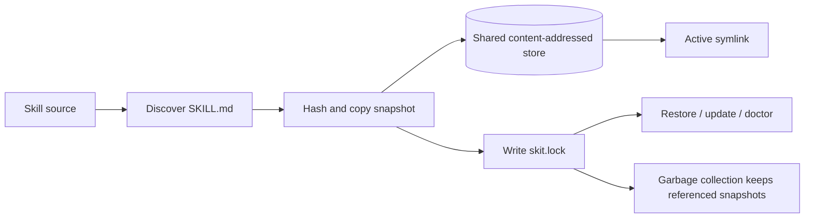

<p align="center">
  
</p>

<h1 align="center">Skill Kit</h1>

<p align="center">
  <strong>Skill management CLI for reproducible agent ecosystems.</strong>
</p>

<p align="center">
  <code>skit</code> discovers, installs, locks, activates, updates, diagnoses, and garbage-collects <code>SKILL.md</code> packages.
</p>

<p align="center">
  <a href="LICENSE"></a>
  
  
  
  
  
</p>

---

Skill Kit is a small, reproducible Skill manager for agent ecosystems. The
product name is **Skill Kit (Skill management CLI)** and the command-line
binary is `skit`.

It works with `SKILL.md` packages as defined by
[agentskills.io](../agentskills.io/): discover Skills, fetch them from local
and git sources, store immutable snapshots, write deterministic locks, activate
Skills through symlinks, and diagnose declared local requirements.

> Status: v0.1. The CLI and lock format are usable, but still allowed to change
> before a first stable release.

## Contents

- [Why Skill Kit](#why-skill-kit)
- [How It Works](#how-it-works)
- [Installation](#installation)
- [Quick Start](#quick-start)
- [Common Workflows](#common-workflows)
- [Bundled Skills](#bundled-skills)
- [Command Reference](#command-reference)
- [Paths](#paths)
- [Sources](#sources)
- [Discovery](#discovery)
- [Metadata](#metadata)
- [Safety](#safety)
- [Ecosystem Imports](#ecosystem-imports)
- [Development](#development)

## Why Skill Kit

Agent Skills should be easy to share, but local installs need the same boring
properties that package managers already taught us to expect: deterministic
locks, stable restore, safe updates, and cleanup that does not delete content
still used elsewhere.

Skill Kit focuses on that lifecycle:

| Need | Skill Kit behavior |
|------|--------------------|
| Reproducible project setup | Writes deterministic `skit.lock` files next to active Skills. |
| Shared local cache | Stores immutable snapshots in a content-addressed global store. |
| Agent compatibility | Activates Skills through symlinks for project, global, and selected agent roots. |
| Safe operations | Does not execute Skill code during install, inspect, update, restore, or doctor. |
| Multi-source installs | Handles local paths, GitHub, GitLab, SSH git, and generic git repositories. |
| Maintenance | Supports update, remove, conservative pruning, and whole-store garbage collection. |
| Interop | Imports existing `skills` and `clawhub` lock files as conservative `incomplete` entries. |

## How It Works



Core model:

- **Source**: a local path or git locator that contains one or more Skills.
- **Snapshot**: an immutable copy of a discovered Skill directory.
- **Store**: a shared content-addressed directory keyed by tree hash and Skill name.
- **Lock**: the reproducible record of source identity, resolved ref, hashes, dependencies, and warnings.
- **Active Skill**: a symlink from `.agents/skills` or `~/.agents/skills` to a store snapshot.

## Installation

Recommended install path for users is a prebuilt binary from GitHub Releases.
Release artifacts are published for macOS, Linux, and Windows, with a checksum
file. macOS and Linux artifacts use `.tar.gz`; Windows artifacts use `.zip`.

Install macOS/Linux with:

```sh
curl -fsSL https://raw.githubusercontent.com/vlln/skit/main/install.sh | sh
```

The installer detects the platform, downloads the matching release asset,
verifies checksums, and places `skit` in `~/.local/bin` or `SKIT_INSTALL_DIR`.
Downloads fail instead of hanging indefinitely: by default the installer uses a
10s connect timeout, 300s total transfer timeout, 30s low-speed timeout, and 3
retries. These can be adjusted with `SKIT_CONNECT_TIMEOUT`, `SKIT_MAX_TIME`,
`SKIT_SPEED_LIMIT`, `SKIT_SPEED_TIME`, and `SKIT_RETRY`.

For restricted networks, point the installer at a release mirror or pre-staged
asset directory with `SKIT_DOWNLOAD_BASE`:

```sh
curl -fsSL https://raw.githubusercontent.com/vlln/skit/main/install.sh |
  SKIT_DOWNLOAD_BASE=https://example.com/skit/releases/<version> sh
```

Package-manager distribution can layer on top of the same release artifacts:

```sh
brew install vlln/tap/skit
```

Uninstall:

```sh
rm -f "${SKIT_INSTALL_DIR:-$HOME/.local/bin}/skit"
```

If installed with Homebrew:

```sh
brew uninstall skit
```

From a local checkout, for development:

```sh
go install ./cmd/skit
```

Or build a local binary:

```sh
go build -o skit ./cmd/skit
./skit version
```

Requirements:

- `git` for remote git sources
- Go 1.23+ only when building from source

## Quick Start

Create a Skill:

```sh
skit init my-skill
```

Install it into the current project:

```sh
skit install ./my-skill
```

List locked Skills:

```sh
skit list
```

Restore active symlinks from the lock on another machine:

```sh
skit install
```

Inspect and diagnose:

```sh
skit inspect my-skill
skit doctor
```

## Common Workflows

### Install From GitHub

```sh
skit install github:owner/repo --skill skill-name
```

Install more than one Skill from the same source:

```sh
skit install github:owner/repo --skill skill-one skill-two
```

Use inline selectors for multiple sources:

```sh
skit install owner/repo@skill-one other/repo@skill-two
```

### Activate For Agents

`--agent` keeps the skit lock and content-addressed store as the source of
truth, then creates extra symlinks for selected agents.

```sh
skit install ./my-skill --agent codex
skit install --global ./my-skill --agent codex
```

Supported agent names:

```text
codex
claude-code
cursor
gemini-cli
opencode
```

For Codex, project installs target `.agents/skills` and global installs target
`${CODEX_HOME:-~/.codex}/skills`. The default skit active roots are already
handled by `--project` and `--global`, so there is no separate universal agent
target.

### Search, Update, And Clean Up

```sh
skit search "skill create"
skit search pdf --source github:owner/awesome-skills
skit search deploy --source ./awesome-skills
skit update
skit remove old-skill
skit gc
```

`skit search --source` is intentionally a one-shot source scan: it reads a
local path or fetches one git repository, discovers `SKILL.md` packages, and
filters them without adding persistent registry or catalog state. Use the
printed install argument with `skit install`.

Inspect the shared store without printing fixed store paths:

```sh
skit list --store
skit list --store --locks demo
skit remove --store demo raerh3OtDDu9
```

`skit install` and `skit update` check for newer skit releases at most once per
day and print a short update hint when one is available. Set
`SKIT_UPDATE_CHECK=0` to disable the automatic check.

## Bundled Skills

Install bundled skills directly from this repository with `skit`:

```sh
skit install --global vlln/skit/skills/<skill-name>
```

| Skill | Description |
|-------|-------------|
| [`search-skills`](skills/search-skills) | Find, evaluate, inspect, and install agent skills with the `skit` CLI. |
| [`make-skill`](skills/make-skill) | Create or revise Agent Skills with precise frontmatter, concise instructions, validation checks, and skit-friendly metadata. |

## Command Reference

| Command | Purpose |
|---------|---------|
| `skit install [source...]` | Install sources, or restore active symlinks from `skit.lock`. |
| `skit search <query>` | Search for Skills. |
| `skit search <query> --source <repo-or-path>` | Search one repository or local path without registering it. |
| `skit list` | List locked Skills. |
| `skit list --agent <name>` | List Skills from an agent-specific `skit.lock`. |
| `skit list --store` | List shared store snapshots with short tree IDs and compact use status. |
| `skit list --store --locks [name...]` | Show which locks or known project paths reference store snapshots. |
| `skit remove <name...>` | Remove locked and active Skills. |
| `skit remove --agent <name> <skill...>` | Remove from an agent-specific `skit.lock`. |
| `skit remove --store <name> [tree-prefix]` | Remove an orphan store snapshot by name and optional tree prefix. |
| `skit uninstall <name...>` | Alias for `remove`. |
| `skit gc` | Garbage collect unreferenced store snapshots. |
| `skit update [name]` | Refresh locked Skills from their sources. |
| `skit inspect <target>` | Inspect a locked Skill or source. |
| `skit doctor` | Check lock, store, hashes, and declared requirements. |
| `skit init [name]` | Create a `SKILL.md` template. |
| `skit import-lock <kind>` | Import a compatible lock file. |
| `skit help <command>` | Show command-specific help. |
| `skit version` | Print the CLI version. |
| `skit version --check` | Check GitHub Releases for a newer skit version. |

Common flags:

```text
--project          Use project scope (default)
--global           Use global scope
--agent <names...> Also activate for specific agents, such as codex
--skill <names...> Select one or more Skills from a single source
--all              Install every discovered non-internal Skill from a source
--full-depth       Search recursively for Skills when installing or searching a source
--ignore-deps      Skip declared Skill dependencies
--no-active        Write store/lock only; do not create active symlinks
--force            Replace an existing non-symlink active path
--prune            With remove, delete unreferenced store snapshots
--store            With list/remove, operate on shared store snapshots
--locks            With list --store, show lock owners
--json             Print JSON for supported commands
```

Run `skit help <command>` for command-specific details, including store,
lockfile, activation, update, garbage collection, and lossy import behavior.

## Paths

Project scope:

```text
.agents/skills/<skill-name>  -> symlink to global store snapshot
.agents/skills/skit.lock     deterministic project lock
```

Global scope:

```text
~/.agents/skills/<skill-name> -> symlink to global store snapshot
~/.agents/skills/skit.lock    deterministic global lock
```

Store and temporary files:

```text
${XDG_DATA_HOME:-~/.local/share}/skit/store/<tree-hash>/<skill-name>/
${XDG_CACHE_HOME:-~/.cache}/skit/tmp/
```

The store is shared across project and global scopes. Active Skills are symlinks
to immutable store snapshots.

## Sources

Supported source forms include:

```text
./skill
/absolute/path
owner/repo
github:owner/repo
owner/repo/path/to/skill
https://github.com/owner/repo/tree/ref/path
gitlab:group/subgroup/repo
https://gitlab.com/group/repo/-/tree/ref/path
git@github.com:owner/repo.git
https://example.com/owner/repo.git
```

Selectors:

```text
source#ref
source#ref@skill-name
owner/repo@skill-name
```

Use `--skill <name>` when a source locator or git ref contains `@` and would be
ambiguous.

Git sources with an explicit subpath, such as `vlln/skit/skills/search-skills`,
use a sparse checkout when possible so install does not need the whole worktree.

## Discovery

Discovery is bounded and deterministic:

- A source root containing `SKILL.md` is one Skill.
- Direct children and common Skill roots are checked next, including
  `skills/`, `.agents/skills`, `.codex/skills`, `.claude/skills`,
  `.opencode/skills`, and `.windsurf/skills`.
- `--full-depth` enables depth-limited recursive discovery.
- `metadata.internal: true` Skills are skipped unless selected explicitly with
  `--skill`.

Lowercase `skill.md` is accepted for ecosystem interoperability and recorded as
a warning.

## Metadata

`skit` reads standard `SKILL.md` frontmatter and `metadata.skit` extensions:

```yaml
---
name: pdf-tools
description: Extract, merge, compress, and inspect PDF files.
metadata:
  skit:
    dependencies:
      - source: github:example/pdf-core
        ref: v1.2.0
        skill: pdf-core
    requires:
      bins:
        - pdftotext
      env:
        - PDF_API_KEY
---
```

Ecosystem metadata such as `metadata.openclaw.requires` is preserved for
inspection and diagnostics. It is not executed.

## Safety

`skit install`, `skit inspect`, `skit update`, and `skit doctor` do not execute
Skill code.

The CLI rejects unsafe source subpaths, rejects non-regular files while copying
snapshots, normalizes executable modes, verifies store hashes, and records
warnings for suspicious content such as piping network downloads into a shell.

## Ecosystem Imports

Existing ecosystem lock files can be imported:

```sh
skit import-lock skills
skit import-lock clawhub
```

Supported imports:

| Kind | Reads | Import behavior |
|------|-------|-----------------|
| `skills` | `./skills-lock.json` | Preserves source fields and `computedHash` as diagnostics. |
| `clawhub` | `./.clawhub/lock.json` or legacy `./.clawdhub/lock.json` | Preserves registry, slug, and version clues when available. |

Lossy imports are marked `incomplete: true` because the source lock may not
contain enough information for reproducible restore. Reinstall the Skill with
`skit install <source>` to make it fully restorable.

## Development

Run tests:

```sh
go test ./...
```

Run the CLI without installing:

```sh
go run ./cmd/skit --help
```

## License

MIT.
